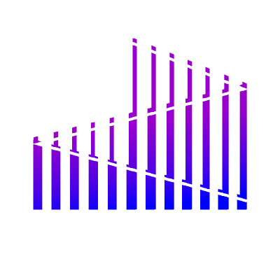

# L1NE COMPANY



---

## 🎯 Tagline

**CONTAINERLESS ORCHESTRATION SYSTEM**

> "Bringing NixOS to the Cloud"

---

## 📋 Sobre a L1NE

**L1ne** é um framework de orquestração sem containers que traz todo o poder do **NixOS** para a nuvem. Permite infraestrutura reproduzível através da implantação de definições de sistema imutáveis e verificáveis ao invés de imagens de containers ou ambientes mutáveis.

Construído com **computação determinística** e **configuração funcional**, a L1ne permite que sistemas escalem através de qualquer provedor por meio de provas criptográficas de integridade de build, transformando orquestração em uma propriedade do próprio sistema operacional.

### Principais Características

- **Infraestrutura Imutável:** Implante definições de sistema verificáveis, não containers
- **Builds Reproduzíveis:** Provas criptográficas garantem integridade de build
- **NixOS Nativo:** Poder completo da configuração declarativa do NixOS
- **Pronto para Multi-Cloud:** Escale através de qualquer provedor de nuvem sem problemas
- **Zero Containers:** Orquestração direta a nível de SO sem sobrecarga de containerização

---

## 🎯 Missão

Nossa missão é criar um **ecossistema de nuvem completo para NixOS** que mantenha todos os benefícios de reprodutibilidade, determinismo e design declarativo.

Com a L1ne, desenvolvedores podem construir, implantar e gerenciar sistemas NixOS nativamente na nuvem sem containers ou camadas complexas de orquestração. Nosso objetivo é tornar a nuvem tão previsível e confiável quanto o próprio Nix, onde cada ambiente é construído a partir da mesma fonte verificada.

### No que Acreditamos

- Infraestrutura deve ser tão reproduzível quanto o software que ela executa
- Determinismo supera complexidade em ambientes de produção
- NixOS merece ferramentas cloud-first nativas
- Containers são uma abstração que podemos transcender

---

## 🔮 Visão

Imaginamos um futuro onde **NixOS roda nativamente através da nuvem**, e infraestrutura é tão reproduzível quanto o software que ela hospeda.

Neste mundo, sistemas escalam por referência, convergem por prova, e operam com segurança através de ambientes heterogêneos. O objetivo da L1ne é tornar infraestrutura global e multi-cloud totalmente determinística para que você possa **construir uma vez, verificar em qualquer lugar e executar em qualquer lugar**.

### O Futuro que Estamos Construindo

- **Escalar por Referência:** Sistemas se propagam através de referências endereçadas por conteúdo
- **Convergir por Prova:** Verificação criptográfica substitui detecção de drift de configuração
- **Segurança por Design:** Imutabilidade e determinismo criam sistemas inerentemente seguros
- **NixOS Cloud Native:** Suporte de primeira classe para NixOS em todos os principais provedores de nuvem
- **Developer First:** Workflows simples e declarativos que Simplesmente Funcionam™

> _"A nuvem deveria ser tão determinística quanto sua máquina local."_

---

## 🔗 Links

- **GitHub:** [https://github.com/l1ne-company](https://github.com/l1ne-company)
- **Website Repository:** [https://github.com/l1ne-company/website](https://github.com/l1ne-company/website)

---

## 🎨 Logo - Código Fonte (GLSL Shader)

A logo da L1ne é uma visualização 3D renderizada em tempo real usando técnicas de **raymarching** com GLSL shaders, criada com p5.js e WebGL.

### Tecnologia

- **p5.js** para renderização WebGL
- **GLSL** para programação de shaders
- **Raymarching** para renderização volumétrica em tempo real
- Animação procedural com 8 barras flutuantes
- Gradiente vertical roxo/azul
- Linha diagonal característica

### Código Completo do Shader

```glsl
// L1ne Company Logo - GLSL Raymarching Shader
// Vertex Shader
attribute vec3 aPosition;
attribute vec2 aTexCoord;

uniform mat4 uModelViewMatrix;
uniform mat4 uProjectionMatrix;

varying vec2 vTexCoord;

void main() {
  vTexCoord = aTexCoord;
  vec4 positionVec4 = vec4(aPosition, 1.0);
  gl_Position = uProjectionMatrix * uModelViewMatrix * positionVec4;
}

// Fragment Shader
precision highp float;

varying vec2 vTexCoord;
uniform vec2 u_resolution;
uniform float u_time;

#define PI 3.14159265359
#define MAX_STEPS 120
#define MAX_DIST 20.0
#define SURF_DIST 0.0005

mat2 rot(float a) {
  float c = cos(a), s = sin(a);
  return mat2(c, -s, s, c);
}

float sdBox(vec3 p, vec3 b) {
  vec3 q = abs(p) - b;
  return length(max(q, 0.0)) + min(max(q.x, max(q.y, q.z)), 0.0);
}

float sdPlane(vec3 p) {
  return p.y + 2.5;
}

// Diagonal line SDF
float sdLine(vec3 p, vec3 a, vec3 b, float thickness) {
  vec3 pa = p - a;
  vec3 ba = b - a;
  float h = clamp(dot(pa, ba) / dot(ba, ba), 0.0, 1.0);
  return length(pa - ba * h) - thickness;
}

float getHeight(int idx) {
  if (idx == 0) return 1.0;
  if (idx == 1) return 1.4;
  if (idx == 2) return 1.9;
  if (idx == 3) return 2.3;
  if (idx == 4) return 2.6;
  if (idx == 5) return 2.2;
  if (idx == 6) return 1.7;
  return 1.3;
}

// Get vertical gradient color based on height within bar
vec3 getBarGradient(float heightRatio) {
  // Purple/violet at top (height = 1.0)
  vec3 topColor = vec3(0.58, 0.30, 0.90);    // Bright purple/violet
  // Blue at bottom (height = 0.0)
  vec3 bottomColor = vec3(0.20, 0.35, 0.85); // Deep blue

  return mix(bottomColor, topColor, heightRatio);
}

vec3 mapBars(vec3 p, out float barIdx, out float heightRatio) {
  float minDist = 1000.0;
  barIdx = 0.0;
  heightRatio = 0.0;

  for (int i = 0; i < 8; i++) {
    vec3 q = p;
    float x = (float(i) - 3.5) * 0.52;
    float floatOffset = sin(u_time * 0.6 + float(i) * 0.8) * 0.12;
    q.x -= x;
    q.y -= floatOffset;

    float h = getHeight(i);
    float d = sdBox(q, vec3(0.22, h, 0.22));

    if (d < minDist) {
      minDist = d;
      barIdx = float(i);
      heightRatio = clamp((q.y + h) / (2.0 * h), 0.0, 1.0);
    }
  }

  return vec3(minDist, barIdx, heightRatio);
}

vec3 map(vec3 p, out float barIdx, out float heightRatio) {
  vec3 bars = mapBars(p, barIdx, heightRatio);
  float ground = sdPlane(p);

  // Diagonal line from upper left to lower right
  vec3 lineStart = vec3(-2.5, 2.0, 0.0);
  vec3 lineEnd = vec3(2.5, -1.5, 0.0);
  float line = sdLine(p, lineStart, lineEnd, 0.04);

  float minDist = bars.x;
  float material = 0.0; // 0 = bar

  if (ground < minDist) {
    minDist = ground;
    material = 1.0; // 1 = ground
  }

  if (line < minDist) {
    minDist = line;
    material = 2.0; // 2 = diagonal line
  }

  return vec3(minDist, material, bars.y);
}

vec3 calcNormal(vec3 p) {
  const float h = 0.0001;
  const vec2 k = vec2(1, -1);
  float dummy1, dummy2;
  return normalize(
    k.xyy * map(p + k.xyy * h, dummy1, dummy2).x +
    k.yyx * map(p + k.yyx * h, dummy1, dummy2).x +
    k.yxy * map(p + k.yxy * h, dummy1, dummy2).x +
    k.xxx * map(p + k.xxx * h, dummy1, dummy2).x
  );
}

float calcAO(vec3 p, vec3 n) {
  float occ = 0.0;
  float sca = 1.0;
  for (int i = 0; i < 5; i++) {
    float h = 0.01 + 0.15 * float(i) / 4.0;
    float dummy1, dummy2;
    float d = map(p + h * n, dummy1, dummy2).x;
    occ += (h - d) * sca;
    sca *= 0.95;
  }
  return clamp(1.0 - 1.2 * occ, 0.0, 1.0);
}

vec3 render(vec3 ro, vec3 rd) {
  vec3 col = vec3(0.0);
  float t = 0.0;
  float barIdx = 0.0;
  float heightRatio = 0.0;

  // Raymarching
  for (int i = 0; i < MAX_STEPS; i++) {
    vec3 p = ro + rd * t;
    vec3 res = map(p, barIdx, heightRatio);
    float d = res.x;
    float material = res.y;

    if (d < SURF_DIST) {
      vec3 n = calcNormal(p);

      if (material < 0.5) {
        // Bar material - vertical gradient
        vec3 baseCol = getBarGradient(heightRatio);

        // Clean modern lighting
        vec3 lightDir = normalize(vec3(0.3, 0.8, -0.5));
        float diff = max(dot(n, lightDir), 0.0) * 0.6 + 0.4;

        // Subtle specular
        vec3 viewDir = normalize(ro - p);
        vec3 halfDir = normalize(lightDir + viewDir);
        float spec = pow(max(dot(n, halfDir), 0.0), 40.0) * 0.4;

        // AO for depth
        float ao = calcAO(p, n);

        col = baseCol * diff * ao + vec3(spec);

        // Subtle emissive glow
        col += baseCol * 0.15;

      } else if (material < 1.5) {
        // Ground - dark reflective
        vec3 baseCol = vec3(0.08, 0.10, 0.18);
        float ao = calcAO(p, n);
        col = baseCol * ao * 0.7;

      } else {
        // Diagonal white line
        col = vec3(0.95, 0.97, 1.0);
        col += vec3(0.2, 0.25, 0.3);
      }

      break;
    }

    t += d * 0.9;
    if (t > MAX_DIST) break;
  }

  // Clean gradient background
  if (t >= MAX_DIST) {
    float grad = smoothstep(-0.3, 0.6, rd.y);
    col = mix(vec3(0.08, 0.10, 0.20), vec3(0.15, 0.12, 0.28), grad);
  }

  // Atmospheric glow around bars
  float glow = 0.0;
  for (int i = 0; i < 8; i++) {
    float x = (float(i) - 3.5) * 0.52;
    float floatOffset = sin(u_time * 0.6 + float(i) * 0.8) * 0.12;
    vec3 barPos = vec3(x, floatOffset, 0.0);

    vec3 rayPos = ro + rd * min(t, MAX_DIST);
    float dist = length(rayPos.xy - barPos.xy);

    float h = getHeight(i);
    float heightFactor = smoothstep(2.5, 0.0, abs(rayPos.y - barPos.y)) * (h / 2.6);

    glow += (0.008 / (dist * dist + 0.1)) * heightFactor;
  }

  vec3 glowColor = mix(vec3(0.20, 0.35, 0.85), vec3(0.58, 0.30, 0.90), 0.5);
  col += glowColor * glow * 0.6;

  return col;
}

void main() {
  vec2 uv = (vTexCoord * 2.0 - 1.0);
  uv.x *= u_resolution.x / u_resolution.y;

  // Camera setup with gentle rotation
  vec3 ro = vec3(0.0, 0.8, 5.5);
  vec3 rd = normalize(vec3(uv, -2.0));

  // Subtle rotation
  rd.yz *= rot(-0.15);
  rd.xz *= rot(u_time * 0.25);
  ro.yz *= rot(-0.15);
  ro.xz *= rot(u_time * 0.25);

  vec3 col = render(ro, rd);

  // Tone mapping for modern look
  col = col / (col + vec3(0.8));
  col = pow(col, vec3(0.4545));

  // Slight contrast boost
  col = mix(vec3(0.5), col, 1.15);

  gl_FragColor = vec4(col, 1.0);
}
```

### Configuração do p5.js

```typescript
import p5 from 'p5'

const sketch = (p: p5) => {
  let theShader: p5.Shader

  p.setup = () => {
    p.createCanvas(400, 350, p.WEBGL)
    theShader = p.createShader(vertShader, fragShader)
  }

  p.draw = () => {
    p.shader(theShader)
    theShader.setUniform('u_resolution', [p.width, p.height])
    theShader.setUniform('u_time', p.millis() / 1000.0)

    p.rect(-p.width/2, -p.height/2, p.width, p.height)
  }
}
```

---

## 🛠️ Stack Tecnológica do Website

- **Frontend:** React 19.2.0 + TypeScript
- **Build Tool:** Vite 7.1.11
- **Styling:** Tailwind CSS 4.1.16
- **3D Graphics:**
  - p5.js 2.0.5
  - Three.js 0.180.0
  - React Three Fiber 9.4.0
- **Animation:** GSAP 3.13.0

---

## 📊 Design System

### Cores Principais

- **Primária (Dourado):** `#c79325` / `#d79326`
- **Fundo:** `#000000` (Preto)
- **Texto:** `#ededed` / `#a4a4a4` / `#6b7280`
- **Borda:** `#352b19`
- **Destaque:** `#00FFFF` (Ciano)

### Paleta de Cores da Logo (Gradiente)

- **Topo (Roxo/Violeta):** `rgb(148, 77, 230)` / `#944de6`
- **Base (Azul Profundo):** `rgb(51, 89, 217)` / `#3359d9`
- **Linha Diagonal:** `rgb(242, 247, 255)` / `#f2f7ff`

### Tipografia

- **Fonte Principal:** Sistema (tracking ajustado)
- **Tamanhos:** 10px - 24px
- **Estilo:** Maiúsculas, espaçamento amplo, negrito para títulos

---

## 🎪 Elementos Visuais

### LED Board Ticker

Banner superior animado com o texto:
> **"INOURED IN THE FINANCIAL MARKET"**

Duração da animação: 25 segundos

### Layout ATC Style

Interface inspirada em painéis de controle de tráfego aéreo (Air Traffic Control), com:

- Grid desktop: 30% (esquerda) / 70% (direita)
- Painéis com headers dourados
- Bordas sutis em tom sépia
- Scroll independente por seção

---

## 📱 Responsividade

- **Desktop:** Layout em grid de duas colunas
- **Mobile:** Layout vertical com scroll

---

## ©️ Copyright

© 2025 L1ne Company. All rights reserved.

**Built with NixOS • Powered by Determinism • Verified by Cryptography**

---

## 📝 Metadados do Projeto

- **Nome:** l1ne-company
- **Versão:** 1.0.0
- **Descrição:** L1ne Company - Containerless orchestration framework website
- **Licença:** ISC
